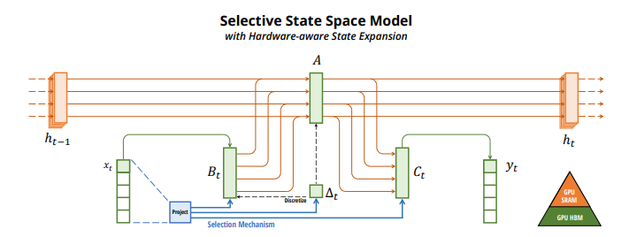
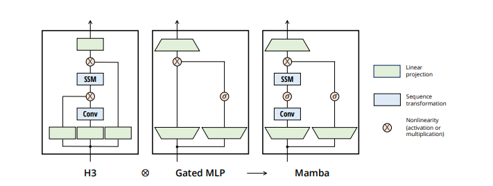
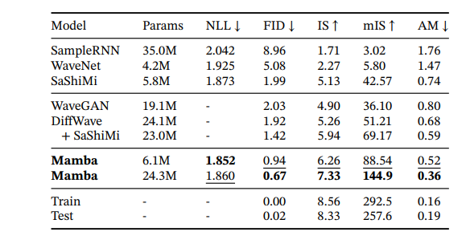
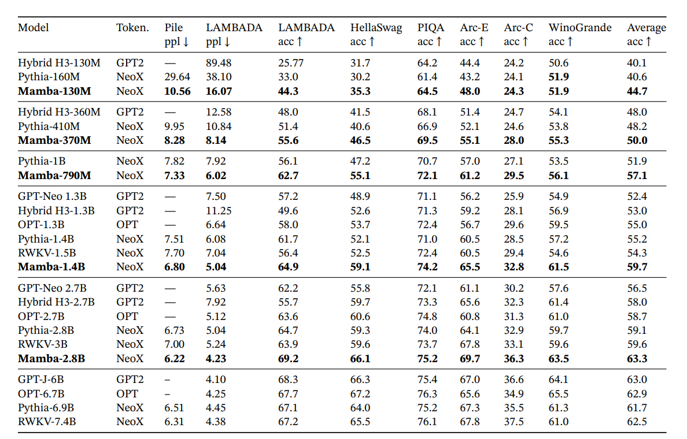
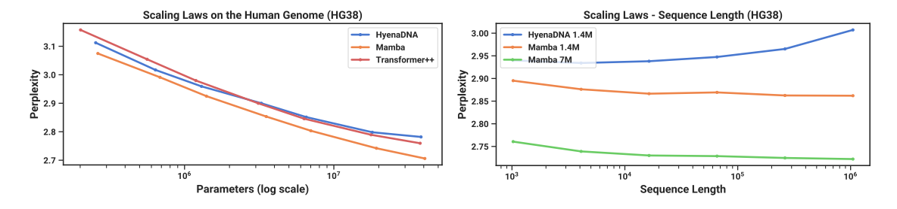
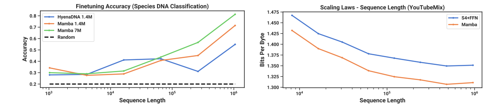
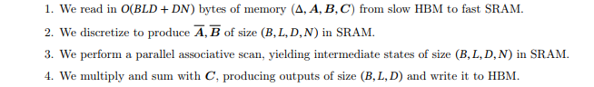

# Mamba - basic concept

Mamba utilizes a novel approach called selective state space models (SSMs), which enhance traditional state space models by allowing 
parameters to be functions of the input. This design enables the model to selectively propagate or forget information along the sequence length,
dependent on the current input token. Mamba integrates this selective SSM approach into a simplified end-to-end architecture, foregoing traditional components 
like attention or MLP blocks found in architectures like Transformers.

The main difference between Selective SSM and traditional SSM is the input-dependence, which mimics what the attention mechanism in Transformers
does—essentially assessing whether a specific token is important or not. However, this feature sacrifices the ability of traditional SSMs
to precompute all learnable matrices (Δ, A, B, C) and their configurations based on sequence length in a single inference pass. 
To address this, we introduce a mechanism of Parallel Associative Scan (similar to Prefix Sum) that requires storing precomputed calculations,
leading to higher memory usage but still maintaining linear computation.

To enhance efficiency further, the authors proposed using a hardware-aware algorithm that leverages two main types of GPU memory: 
SRAM, which is fast but has limited capacity (ideal for matrix calculations), and HBM, which is slower but has a larger capacity. 
The main bottleneck of this approach is managing the data transfer between these memory types.

Selective SSM is a crucial component of the Mamba block, but the system also includes linear layers that increase dimensionality, nonlinear layers, and gating connections.
Whole architecture is build from many Mamba block which are computed layer by layer.

# Why is it so great

Quick comparison

| Architecture  | Complexity | Memory | Performance |
|---------------|----------|--------|-------------|
| Transformer   | O(N^2)   | O(N^2) | great       |
| RNN           | O(N)     | O(N)   | poor        |
| SMM           | O(N)     | O(N)   | poor        |
| Selective SSM | O(N)     | O(N)   | great       |

Originally it is created for modeling long sequences with big context with efficient usage of it like DNA's or audiowaves

# Where applied
Already applied in:
- Computer Vision [Paper](https://arxiv.org/abs/2401.09417)
- Mixture of Experts [Paper](https://arxiv.org/abs/2401.04081)
- For learning on raw Bytes [Paper](https://arxiv.org/abs/2401.13660)
- Biology sequences [Paper](https://www.biorxiv.org/content/10.1101/2024.02.28.581983v1.full)

Benchmarks:

Speech Generation:

DNA:

# Implementation restrictions

Hardware aware algorithm:

Interesting implementation for dealing with that: [link](https://github.com/PeaBrane/mamba-tiny)
